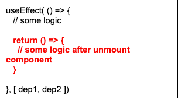
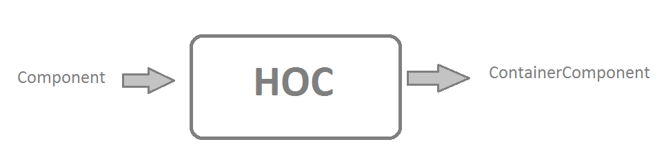

# React, Redux and more #

## This page about React, Redux and more

# `React`

`React` - это **библиотека** для создания пользовательских интерфейсов (**не фреймворк!**). React нужен для эффективной
отрисовки приложения, и для этого у него есть `**Virtual DOM**`. Virtual DOM сравнивается с DOM-ом браузера, и если он
находи различия - происходит замена узла, а не всей страницы.

# `Virtual DOM`

`Virtual DOM` - 'облегченный' DOM - это набор техник\алгоритмов, которые позволяют нам улучшить производительность,
избегая работы с DOM. Virtual DOM хранится в памяти компьютера и синхронизируется с настоящим DOM при помощи **React
DOM**.  
Процесс сравнения Virtual DOM c DOM называется **согласованием** (**reconciliation**).

# `Component`

`Component` - компонента - это функция, принимающая **props** и возвращающая **jsx** разметку. Состоите из двух частей:
верхняя (над return) и нижняя (внутри return).

# `Hooks`

`Хуки` - это функции, с помощью которых вы можете «подцепиться» к состоянию и методам жизненного цикла React из
функциональных компонентов. Хуки не работают внутри классов — они дают вам возможность использовать React без классов.

`Правила хуков:`

* использовать хуки можно только на верхнем уровне
* нельзя вызывать внутри циклов, условных операторов и вложенных функций
* используются только в функциональных компонентах

### `Хуки:`

* `useState` - хук состояния. Хранит в себе состояние и функцию для изменения состояния.

```JS
const [count, setCount] = useState(10)
```

* `useEffect` - дает возможность выполнить побочные эффекты в функциональных компонентах и перехватить изменения. Есть
  зависимости, если зависимости не указываем, то функция отработает один раз при отрисовке компоненты.  `useEffect` можно представить себе как комбинацию `componentDidMount`, `componentDidUpdate` и `componentWillUnmount` в классовых компонентах.
Извлечение данных, настройка подписки и ручное изменение DOM-дерева - все это `побочные эффекты`.
Зачем его применять? Его нужно использовать, когда вы собираетесь сообщать React, что ваш компонент должен сделать **после отрисовки**.
`useEffect` по умолчанию запускается как после первой отрисовки, так и после перерисовки.

```typescript jsx

function Example() {
    const [count, setCount] = useState<number>(0);

    useEffect(() => {
        document.title = `Вы нажали ${count} раз`;
    });

    return (
        <div>
            <p>Вы нажали {count} раз</p>
            <button onClick={() => setCount(count + 1)}>
                Click me
            </button>
        </div>
    );
}
// useEffect пишется внутри компоненты на верхнем уровне, для того,
// чтобы можно было получить доступ к переменным состояния или другим свойства.

```

* `useContext` - позволяет подписывать на контекст React
* `useReducer` - позволяет управлять сложным состоянием компонентов
* `useCallback` - управление функциями обратного вызова
* `useMemo` - управление '**мемоизированными**' значениями

# `useEffect`
`useEffect` - это хук, который используется в React для выполнения побочных эффектов в функциональных компонентах. Этот хук вызывается после каждого рендеринга компонента и позволяет вам выполнять операции, которые не связаны с обновлением пользовательского интерфейса, такие как работа с сетью, установка и удаление слушателей событий и т.д.

**_Например:_**
* подписка\отписка
* работа с DOM-деревом
* асинхронные запросы на сервер

**useEffect** принимает два аргумента: функцию-эффект и массив зависимостей. Функция-эффект - это функция, которая будет выполнена после каждого рендеринга компонента. Массив зависимостей содержит переменные, которые будут отслеживаться для определения необходимости повторного вызова функции-эффект

Что было в классовых компонентах:

| Метод ЖЦ             | Поведение                                                    |
|----------------------|--------------------------------------------------------------|
| **componentDidMount**    | компонент смонтирован запускается 1 раз на старте            |
| **componentDidUpdate**   | запускается, когда есть изменения в компоненте               |
| **componentWillUnmount** | компонент будет удален запускается перед удаление компоненты |
| **componentDidUnmount**  | удаляется из DOM-дерева                                      |


| Hook                                                     | Class livecycle                                                                                                                                            |
|----------------------------------------------------------|------------------------------------------------------------------------------------------------------------------------------------------------------------|
| <code> useEffect( () => {} )      </code>                | **componentDidMount** </br> **componentDidUpdate** </br> <br/> здесь нет зависимостей. будет меняется постоянно, если что-то меняется в компоненте.        |
| <code> useEffect( () => {}, [ ])   </code>               | **componentDidMount** <br/> <br/> вызывается 1 раз, после того, как компонент будет добавлен в дом. Будет вызываться, если меняются зависимости в массиве. |
| <code> useEffect( () => {}, [ dep1, dep2 ] )     </code> | **componentDidUpdate** <br/> <br/> вызов при изменении зависимости                                                                                         |
|                                       | **componentDidUnmount** <br/> <br/> вызов перед удалением компонента                                                                                            |


# `HOC`

`HOC` - **High order component** - компонента высшего порядка - это функция, которая принимает компоненту и возвращает
новую компоненту. Задача `HOC` - принять однку компоненту, а вернуть другую, наделенную какими-то способностями.



# Reconciliation

`Reconciliation` - **СОГЛАСОВАНИЕ** - механизм, работающий в паре с __Virtual DOM__. Когда состояние меняется, этот
механизм проходит по virtual dom, определяя, какие узлы изменились.  
Т.е. это процесс, посредством которого React обновляет DOM. Когда состояние компонента изменится - перерисуй.

### Алгоритм:

* **Элементы различных типов**. Старые элементы удаляются, и вложенные дочерние тоже:

```jsx
<div>
    <span>HI!!!</span>
</div>

// сравниваем с этим кодом:

<header>
    <span>HI!!!</span>
</header>

// div поменялся на header, значит этот узел нужно перерисовать. Дочерний элемент span тоже.

```  

* **DOM-элементы одного типа**:

```jsx
<div clasName='before' title='stuff'/>
// сравниваем
<div clasName='after' title='stuff'/>

// в теге div атрибут className изменился, значит модифицируем только className
```  

* **Компоненты одного типа**. Когда компонент обновляется, его экземпляр остаётся прежним, поэтому его состояние
  сохраняется между рендерами. React обновляет пропсы базового экземпляра компонента для соответствия новому элементу.
* Рекурсия по дочерним элементам
* Ключи: `key`

**Источник:** [`ru.reactjs.org`](https://ru.reactjs.org/docs/reconciliation.html)


