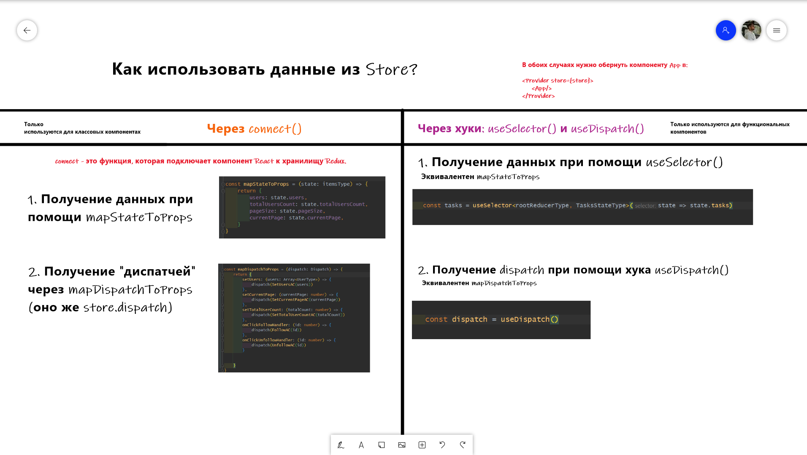

# ⚙️ Redux #

## This page about Redux 

# `Redux`

**`Redux`** - менеджер состояний - библиотека, предназначенная для управления состоянием приложения.

* используются для **средних** и **крупных** приложений
* можно и без него
* эффективное управление **state**
* **простым** приложениям он не нужен

### **`Использование:`**

`Action` - описывает действие (т.е. что будем делать) - объект, который имеет как минимум свойство **type**:

```typescript
const AddTaskAction: ExampleType = {
    type: 'ADD_TASK',
//    может быть что-то еще
    newText: 'Какая-то строка',
}
```  

`Action Creators` - создатель действия - это функции, которые создают действия. Могут принимать аргументы.

```typescript
    const AddTaskActionCreator = (newText: string): ExampleType => {
    return {type: 'ADD_TASK', newText}
}
```  

`Reducer` - это **чистая** функция, принимающая **state** и **action** и возвращающая преобразованную копию **state**.  
Обращаю внимание, что **reducer** - это _**чистая функция**_, а следовательно она _**детерминирована**_, _**
идемпотентна**_ и _**имутабельна**_.

```typescript
export const ExampleReducer = (state = initState, action: ActionType): ExampleTypeState => { // к нам приходит state и action
    switch (action.type) { // в каждом action сидит type. Их и смотрим
        case 'ADD_TASK':  // если type соотв. action.type
            return {...state, tasks: action.task} // это пример. Возвращает имзенененную копию state
        default:
            return state
    }
}
```  

`Store` - это объект-хранилище.

* Содержит состояние приложения
* отображает их через **getState()**
* обновляется через **dispatch()**
* можно уведомлять через **subscriber()**

`combineReducer` - возвращает "большую" функцию - метод, позволяющий нам создавать большой редюсер для всего состояния
сразу, разбивая его на отдельные модули.

**Источники:**

* [`habr.com`](https://habr.com/ru/post/498860/)
* [`redux-ru.js.org`](https://redux-ru.js.org/#documentation)
* [`redux.js.org`](https://redux.js.org/introduction/getting-started)

# `React-redux`

`React-redux` - это пакет для подключения `react` к `redux`. После установки все наше дерево компонентов в react имеет
доступ к **store** и может подписываться на него. Для того, чтобы **store** можно было использовать в компонентах,
у `react-redux` есть специальный метод `Provider`:

```typescript jsx
ReactDOM.render(
    <Provider store={store}>
        <App/>
    </Provider>,
    document.getElementById('root'));
```  

После этого в дочерних компонентах мы можем использовать данные из `store`.  
Способ "взятия" данных зависит от компоненты:

* В __функциональных__ компонентах мы используем хук `useSelector`, и для отправки **action** используем `useDispatch`
* В __классовых__ компонентах мы используем `connect()`, `mapStateToProps` и `mapDispatchToProps`.



# `Redux-thunk`

`Redux-thunk` - **"санки"** - это функция, позволяющая выполнять несколько асинхронных операций. Её можно диспатчить
в **store**, где она сама потом диспатчит в него **action**.  
"Санки" нужны, чтобы избежать общения **UI** и **DAL**, а также чтобы передавать несколько **action** сразу и выполнять
асинхронные операции.

### Установка:

```shell
yarn add redux-thunk
```  

### Применение:

1. `applyMiddleware` - это предложенный **redux** способ добавления усилителей (т.е. различных **Middleware**).  
   `Middleware` - это всегда функция, которая всегда возвращает функцию (если нет цели прервать цепочку вызовов).  
   В файле с нашим **redux-store** мы ипортируем **applyMiddleware** из **redux** и наш промежуточный уровень
    - `thunkMiddleware`:

```js
import {createStore, combineReducer, applyMiddleware} from 'redux'
// обратите внимание, что applyMiddleware импортируется из redux
import thunkMiddleware from 'redux-thunk'
```  

2. Добавляем функцию **applyMiddleware** с параметром **thunkMiddleware** туда, где мы объявляем **store** с **
   редюсерами** (т.е. параметром к функции **createStore**):

```JS
let store = createStore(reducers, applyMiddleware(thunkMiddleware))
// передали в createStore вторым параметром applyMiddleware(thunkMiddlware)
```  

3. В файле с целевым редюсером (например **tasksReducer**) создаем **thunkCreator** (по аналогии с **actionCreator**):  
   <small>Пример написан с использованием typescirt</small>

```Typescript
const getTasksThunkCreator = (todolistId: string) => { // создаем наш thunk creator
    return (dispatch: Dispatch) => {
        todolistAPI.getTasks(todolistId) // запрос через API по ID тудулиста
            .then(resp => { // обработка промиса
                const tasks = resp.data.items // таски с сервера
                const action = setTasksAC(tasks, todolistId) // action
                dispatch(action) // диспатчим экшн
            })
    }
}
```  

4. После этого в нашей компоненте мы используем эту "САНКУ":  
   <small>Пример написан с использованием функциональной компоненты и с использование TypeScript</small>

```typescript jsx
type PropsType = {
    todolistId: string
}
export const ExampleComponentTodolist = (props: PropsType) => {
    const dispatch = useDispatch() // используем диспатч

    // всю асинхронные действия функц.компоненты мы выполняем в useEffect:
    useEffect(() => {
        dispatch(getTasksThunkCreator(props.todolistId))
        // диспатчим санку с id нашего тудулиста
    }, [props.todolistId]) // не забываем указывать зависимости для useEffect

    return (
        <div>
            ...
            Отрисовка
            JSX
            ...
        </div>
    )
}
```  
